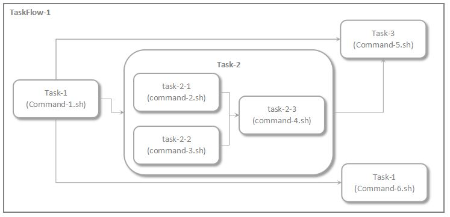

# EBR (External Batch Runner)


README

- [English](./README.md)
- [中文](./README.zh_CN.md)

Note: 個人学習用プロジェクトのため、設計書やベストプラクティスは一切ありません。

EBR(External Batch Runner)は明確な依存の関係を持つ外部プログラムを並列で実行するツールである。

外部プログラムとは

- スクリプト (shell, bat, python...)
- コマンド(GUIが無いプログラム)

例え、下記のような実行対象となるコマンド間の関係定義がある

```xml
<?xml version="1.0" encoding="UTF-8"?>
<task id="TaskFlow-1" desc="root group">
    <task id="task-1" desc="run command-1" command="/your/path/command-1.sh"/>
    <task id="task-2" desc="task group-1" depends="task-1">
        <task id="task-2-1" desc="run command-2" command="/your/path/command-2.sh"/>
        <task id="task-2-1" desc="run command-3" command="/your/path/command-3.sh"/>
        <task id="task-2-3" desc="run command-4" depends="task-2-1,task-2-2" command="/your/path/command-4.sh"/>
    </task>
    <task id="task-3" desc="run command-5" depends="task-1,task-2" command="/your/path/command-5.sh"/>
    <task id="task-4" desc="run command-6" depends="task-1" command="/your/path/command-6.sh"/>
</task>
```

下記コマンドを叩くと

```sh
java -jar /${your_path}/ebr-cli.jar -f /${your_path}/your_define.xml
```

指定されたコマンド間の依存関係を分析し、下記図のような有向非巡回グラフ（DAG）を作成する。そして、外部プログラムは定義に従って順次実行される。




開発環境

- OS: Debian 9
- JDK: OpenJDK 11

使用したライブラリ

- OpenJDK 11
