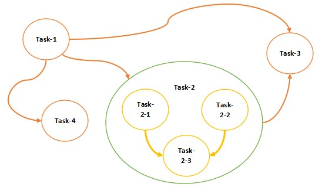

# EBR (External Batch Runner)


[](https://github.com/catforward/ebr/blob/master/LICENSE)

[English](./README.md) | [日本語](./README.ja_JP.md)


## 简介

**EBR** 是一个简单的任务流程编排工具，用来管理并执行若干有明确依赖关系的任务。
> 个人项目，不定期更新

## 快速开始

### 任务编排
- 例如：任务流FLOW-4的定义保存于[/sample_path/ebr/data/FLOW-4.json]，且任务定义如下

```json
{
  "flow": {
    "desc": "sample flow-4 (nested hybrid)"
  },
  "T1": {
    "group": "flow", "desc": "test task unit T1", "script": "echo.sh T1"
  },
  "T2": {
    "group": "flow", "desc": "test task unit T2",
    "depends": [ "T1" ]
  },
  "T2-1": {
    "group": "T2", "desc": "test task unit T2-1", "script": "echo.sh T2-1"
  },
  "T2-2": {
    "group": "T2", "desc": "test task unit T2-2", "script": "echo.sh T2-2"
  },
  "T2-3": {
    "group": "T2", "desc": "test task unit T2-3", "script": "echo.sh T2-3",
    "depends": [ "T2-1", "T2-2" ]
  },
  "T3": {
    "group": "flow", "desc": "test task unit T3", "script": "echo.sh T3",
    "depends": [ "T1", "T2" ]
  },
  "T4": {
    "group": "flow", "desc": "test task unit T4", "script": "echo.sh T4",
    "depends": [ "T1" ]
  }
}
```
> 在运行时会被转换成以下的图（DAG）结构
<br>


- 启动服务器
```bash
root@sample-server: /sample_path/ebr/bin/server-startup.sh
```

- 命令行工具
```bash
root@sample-server: /sample_path/ebr/bin/ebr show
URL                                       State                 LastModifiedTime          Size(bytes)
-----------------------------------------------------------------------------------------------------
/FLOW-4                                   stored                2021-07-16 19:45:54               881


root@sample-server: /sample_path/ebr/bin/ebr show -f /FLOW-4
URL               Type    State     Depends                             Script
-----------------------------------------------------------------------------------------------------------
/FLOW-4/T4        task    stored    /FLOW-4/T1                          /sample_path/ebr/bin/echo.sh T4
/FLOW-4/T1        task    stored    --                                  /sample_path/ebr/bin/echo.sh T1
/FLOW-4/T2        group   stored    /FLOW-4/T1                          --
/FLOW-4/T2/T2-3   task    stored    /FLOW-4/T2/T2-1, /FLOW-4/T2/T2-2    /sample_path/ebr/bin/echo.sh T2-3
/FLOW-4/T2/T2-1   task    stored    --                                  /sample_path/ebr/bin/echo.sh T2-1
/FLOW-4/T2/T2-2   task    stored    --                                  /sample_path/ebr/bin/echo.sh T2-2
/FLOW-4/T3        task    stored    /FLOW-4/T1, /FLOW-4/T2              /sample_path/ebr/bin/echo.sh T3

root@sample-server: /sample_path/ebr/bin/ebr run -f /FLOW-4
```
- 任务的执行顺序
```bash
T1 --> T4,T2-1,T2-2 --> T2-3 --> T3
```


## 使用场景例


